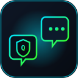
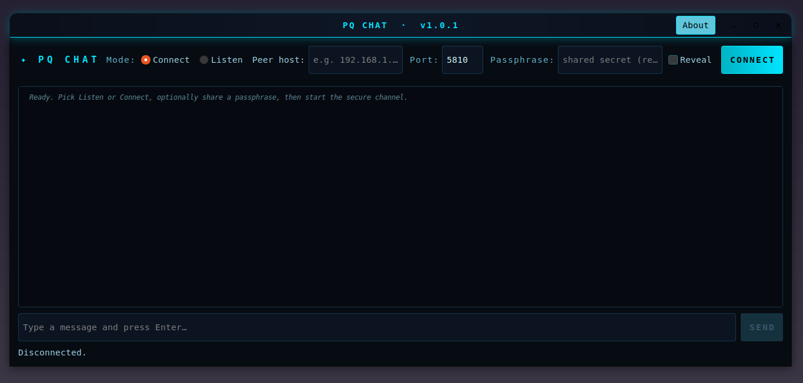

<div align="center">



<a href="https://github.com/effjy/pq-chat/"></a>


**Talk directly to another machine over an end-to-end encrypted, post-quantum
channel with *forward secrecy* — no server, no cloud, no account.**

<a href="https://github.com/effjy/pq-chat/releases"></a>
<a href="https://github.com/effjy/pq-chat"></a>
<a href="https://github.com/effjy/pq-chat"></a>
<a href="https://github.com/effjy/pq-chat"></a>
<a href="https://github.com/effjy/pq-chat"></a>
<a href="https://github.com/effjy/pq-chat"></a>
<a href="https://github.com/effjy/pq-chat"></a>

<br>

<!-- Take your own screenshot of the running app and save it here as screenshot.png -->


</div>

---

## What it is

PQ Chat is a small GTK3 desktop messenger that connects **two peers directly**.
One side **listens** on a port; the other **connects** to it. They negotiate a
fresh session key with a hybrid **Kyber-1024 + X448** handshake — authenticated
by an optional shared passphrase — and from then on **every message is sealed
with its own one-time key produced by a Double Ratchet**.

That ratchet is the headline feature. Unlike a static "encrypt under one session
key" design, the Double Ratchet gives the conversation two properties that the
rest of the suite's at-rest tools don't need but a live conversation very much
does:

- **Forward secrecy** — each message key is derived, used once and destroyed.
  Compromising a device *today* does not expose the messages already sent
  *yesterday*.
- **Post-compromise security ("self-healing")** — fresh Diffie-Hellman material
  is mixed in on every turn of the conversation, so even after a key compromise
  the channel recovers its secrecy after one round trip.

It shares the cryptographic core of
[PQ Transfer](https://github.com/effjy/pqtransfer) and
[Ciphers](https://github.com/effjy/ciphers) — the same hybrid KEM, CPace PAKE
and hardened-memory discipline — and adds a faithful implementation of Signal's
[Double Ratchet](https://signal.org/docs/specifications/doubleratchet/) on top.

---

## Features

- **Serverless, direct peer-to-peer chat** — one listens, one connects, nothing
  in between. No accounts, no metadata broker.
- **Post-quantum handshake** (Kyber-1024 + X448 hybrid KEM): the root key stays
  secure as long as *either* primitive holds, so a "harvest now, decrypt later"
  adversary who records the whole session must break **both** Kyber **and** X448.
- **Double Ratchet for every message** — forward secrecy and post-compromise
  security, a fresh **XChaCha20-Poly1305** key per message, message headers
  bound as associated data (tamper-evident), and out-of-order tolerance.
- **Optional shared passphrase** via a real **CPace PAKE** (over Ristretto255):
  authenticates the channel with *no offline dictionary attack* — an attacker
  gets at most one online guess per connection, even for a short passphrase.
- **Hardened memory** — passphrases, the root key, chain keys and message keys
  live in `libsodium` locked, non-dumpable memory and never hit swap; core
  dumps are disabled and the process is marked non-dumpable.
- **No dependencies beyond the basics** — C, GTK 3, libsodium, libargon2 and
  OpenSSL; the Kyber-1024 reference lives in-tree.

---

## Prerequisites

PQ Chat needs GTK 3, libsodium, libargon2 and OpenSSL (libcrypto), plus a C
compiler, `make` and `pkg-config`.

**Debian / Ubuntu / Mint**
```sh
sudo apt install build-essential pkg-config \
    libgtk-3-dev libsodium-dev libargon2-dev libssl-dev
```

**Fedora / RHEL**
```sh
sudo dnf install gcc make pkgconf-pkg-config \
    gtk3-devel libsodium-devel libargon2-devel openssl-devel
```

**Arch / Manjaro**
```sh
sudo pacman -S base-devel gtk3 libsodium argon2 openssl
```

---

## Build

```sh
git clone https://github.com/effjy/pq-chat.git
cd pq-chat
make
```

This produces the `./pqchat` binary. Run it directly with `./pqchat`.

---

## Install

To install system-wide (binary, icons and an application-menu entry):

```sh
sudo make install
```

This installs the scalable and raster icons globally, so the **PQ Chat icon
shows in the window title bar and the taskbar**. To remove everything:

```sh
sudo make uninstall
```

By default it installs under `/usr/local`; override with `PREFIX`, e.g.
`sudo make install PREFIX=/usr`.

---

## Usage

PQ Chat is symmetric: one machine listens, the other connects. **Start the
listener first.**

### On the listening machine

1. Choose **Listen**.
2. Leave *Listen on* blank (all interfaces) or enter a specific local IP.
3. Pick the **port** (default `5810`).
4. Optionally type a **passphrase** (strongly recommended).
5. Click **LISTEN** — it now waits for the peer.

### On the connecting machine

1. Choose **Connect**.
2. Enter the listener's **host / IP** and the same **port**.
3. Enter the **same passphrase**.
4. Click **CONNECT**.

Once the handshake completes, both sides see *“Secure channel established”* and
can type messages — your lines appear in green, the peer's in cyan. **DISCONNECT**
tears the session down; closing the window does the same.

> **Networking note.** This is a direct TCP connection (IPv4 and IPv6; the
> listener binds dual-stack). On a LAN or VPN it just works. Across the
> internet, the listener must be reachable on the chosen port
> (port-forwarding / firewall rule).

---

## How it works

### 1. Handshake (PQXDH-style)

```
  LISTENER ("Bob")                              CONNECTOR ("Alice")
  ────────────────                              ───────────────────
  generate Kyber-1024 + X448 KEM keypair
  generate X448 ratchet keypair
  CPace: pick Yb from (passphrase, sid)
        │ HELLO: magic | sid | Yb | KEM pk | ratchet pub
        ├───────────────────────────────────────────────►
        │                       encapsulate → KEM secret
        │                       CPace: pick Ya from (passphrase, sid)
        │ magic | Ya | KEM ciphertext
        ◄───────────────────────────────────────────────┤
  decapsulate → KEM secret                               │
        │ both:  ISK      = CPace(Ya, Yb)                │
        │        root key = H(ISK; KEM secret, Ya, Yb)   │
        │ priming message (seeds Bob's first send chain) │
        ◄───────────────────────────────────────────────┤
```

The root key binds **both** the post-quantum KEM secret **and** a
[CPace](https://datatracker.ietf.org/doc/draft-irtf-cfrg-cpace/) PAKE keyed by
the passphrase. It stays secret if **either** the hybrid KEM holds (post-quantum
confidentiality against any passive eavesdropper) **or** the passphrase is
unknown to an active attacker (CPace gives mutual authentication with *no offline
dictionary attack* — one online guess per connection). With an **empty**
passphrase, CPace degrades to a plain ephemeral DH: you keep confidentiality
against passive eavesdroppers but lose authentication, so **set a passphrase
whenever the path between peers is untrusted.**

### 2. Double Ratchet (every message)

The root key seeds a Double Ratchet. Each message advances a symmetric **chain
key** (a fresh message key per message — *forward secrecy*), and each turn of the
conversation mixes in a new **X448** key pair, re-deriving the root key
(*post-compromise security*). Messages are sealed with **XChaCha20-Poly1305**;
the per-message header (ratchet public key + counters) is authenticated as
associated data, so reordering or tampering fails the tag.

```
  root key ──► KDF_RK ──► chain key ──► KDF_CK ──► message key  (use once, delete)
                  ▲                         │
        new X448 DH on each turn            └─► next chain key ─► next message key …
```

### Security model — where the "post-quantum" lives

The **handshake** is post-quantum: the root key is protected by the Kyber-1024 +
X448 hybrid KEM, so an adversary recording the session today cannot reconstruct
it later with a quantum computer without breaking *both* primitives. The
**continuous DH ratchet** is classical X448 (as in Signal). This is the same
layering production systems adopted first — secure the key agreement against
"harvest now, decrypt later," then ratchet for forward/post-compromise secrecy.
A future release may extend the ratchet itself to a hybrid PQ construction.

PQ Chat protects messages **in transit** between two endpoints you control. It is
not an anonymity tool — the two IP addresses see each other — and it does not
persist conversations to disk.

---

## Testing

The cryptographic core is covered by two headless tests under `tests/`:

- `test_ratchet.c` drives the Double Ratchet directly: same-chain bursts,
  out-of-order delivery (skipped-key storage), DH-ratchet turn-arounds, replay
  rejection and tamper rejection.
- `test_session.c` runs a full listener + connector over `127.0.0.1` and holds a
  three-round conversation, then checks that a mismatched passphrase is rejected.

Build and run them with the compile lines documented at the top of each file.

---

## Changelog

### v1.0.1

- Initial public release: post-quantum handshake (Kyber-1024 + X448) + CPace
  PAKE, Signal Double Ratchet over X448 with XChaCha20-Poly1305, GTK3 UI, and
  hardened (locked, non-dumpable) memory for all secret material.

---

## License

MIT © 2026 Jean-Francois Lachance-Caumartin
